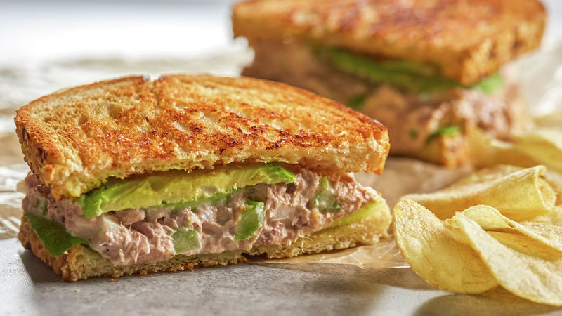

## Exercise #6.1 War and Peace

Write a Java method that given a string `text`, returns `true` if the string "war" and "peace" appear the same number of times in `text`. 


All input letters are in **lowercase**.


Test cases :

```
warAndPeace("there was never a good war, or a bad peace") → true
warAndPeace("war what is it good for") → false
```


## Exercise #6.2 Valid ID and Check Digit

You work for a manufacturer that makes a product with a unique ID string to encode the attributes of the product.
The last character of the ID is a check digit which is the sum of the digits '0-9' that appear in the ID, ignoring all other characters, modulo 11, using the character 'X' if the remainder is 10.


Write a Java method that takes an ID string and determines whether or not it is a valid ID number.
Note that an ID string is of length at least 5, uses upper or lower case letters, as well as dashes '-'.

Note that `Character.isDigit(char)` tests if a char is one of the chars '0', '1', ..., '9'. Also recall that `Integer.parseInt(string)` converts a string to an int.

Test cases :

```
isValidID("THMBB7092WD114221") → false
isValidID("A001-606X-17X") → true
```


## CW1 #6.1 Sandwich Fillings

A sandwich is two pieces of bread with fillings in between (possibly another bread).
Write a Java method that **returns the string** that is between the *first* and *last* appearance of "bread" in the given input string, or returns the string "none" if there are not two pieces of bread. 



All input letters are in lowercase.


Test cases :

```
sandwichFillings("breadtunabread") → tuna
sandwichFillings("chipsbreadtunasalad") → none
```


## CW1 #6.2 Calculate Net Income

To create a home budget, you want to find out your net income, which is your income minus your expenses.

Write a Java method that takes an input string and computes the income minus the expenses.
The income components are indicated by numbers; while the expenses from your spending are numbers starting with a minus sign '-'.


The input string may contain lowercase and uppercase letters, as well as other characters.

Note that Character.isDigit(char) tests if a char is one of the chars '0', '1', ..., '9'. Also recall that Integer.parseInt(string) converts a string to an int.


Test cases :

```
calcNetIncome("salary 15000yuan bonus2000 rent -1000Y") → 16000
calcNetIncome("25000 gross income, -200 water, electricity:-300") → 24500
```


