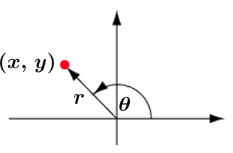

# Week 2

##  Exercise #2.1 "I love you 3000."

Write a Java program that prints "I love you 3000."
Note that that includes the **two double quotes**.


Test case 1:
Output: "I love you 3000."

**For example:**

```
"I love you 3000."
```

```java
public class SimpleMath {
    public static void main(String[] args) {
        
    }
}
```


## CW1 #2.1 Simple Math

Write a Java program that uses basic math to print computation results as in the test case below.

Test case 1:
Output: 

```
num1 + num2 = 13
num1 / num2 = 3
real1 + real2 = 13.0
real1 / real2 = 3.3333333333333335
```

```java
public class SimpleMath {
    public static void main(String[] args) {
        
    }
}
```


## CW1 #2.2 ASCII Art

Write a Java program thaMaket prints characters depicting a Christmas tree as in the test case below.
Note that you will need to use **escape characters**.


Test case 1:

Output:

```
   *
  / \
 /   \
/     \
--| |--
-------
```


```java
public class CharXmasTree {
    public static void main(String[] args) {
        
    }
}
```


# Week 3

## Exercise #3.1 What day is it?

Write a Java program that takes a date as input and prints the day of the week that date falls on.

Your program should take three integers: y (year), m (month), and d (day).
For m use 1 for January, 2 for February, and so on.
For output print 0 for Sunday, 1 for Monday, 2 for Tuesday, and so on.

Use the following formulas:


$$
\begin{align}
a &= y - ( 14-m ) / 12 
\\b &= a + a/4 - a/100 + a/400
\\c &= m + 12\  \times \ ((14-m)/12)-2
\\day &= (d+b+(31 \times c)/12) \mod7 
\end{align}
$$


| Input                | Output       |
| -------------------- | ------------ |
| 2018<br />12<br />24 | It's day 1 ! |

```java
import java.util.Scanner;

public class DateToDay {
    public static void main(String[] args) 

    }
}
```


## Exercise #3.2 Polar Coordinates

Write a Java program that converts Cartesian coordinates to Polar coordinates.
Your program should take two real input numbers x and y, and print the Polar coordinates r and θ according to the formulas below.


$$
r = \sqrt{x^2+y^2}
\\ \theta = arctan\left( \frac{y}{x} \right)
$$
Note that you should use the Java method `Math.atan2(y, x)`, which can comfile:///home/ous50/Tarnhelm/app/src/main/res/layout/activity_settings.xmlpute the arctangent value of y/x in all quadrants.


**For example:**

| Input        | Result                                                  |
| ------------ | ------------------------------------------------------- |
| 3.0<br />4.0 | r = 5.0 <br />theta = 0.9272952180016122                |
| 1.0<br />1.0 | r = 1.4142135623730951 <br />theta = 0.7853981633974483 |

```java
import java.util.Scanner;

public class PolarCoordinates {
    public static void main(String[] args) {
        
    }
}
```


## CW1 #3.1 CMYK to RGB

There are several different formats used to represent color.
You may have known the *RGB format* that specifies the level of red (R), green (G), and blue (B) on an *integer* scale from 0 to 255.
There is another format called the *CMYK format* that specifies the level of cyan (C), magenta (M), yellow (Y), and black (K) on a *real* scale from 0.0 to 1.0.


Write a Java program that converts from CMYK format to RGB format using the following formulas:

white = 1 − black
red = 255 × white × (1 − cyan)
green = 255 × white × (1 − magenta)
blue = 255 × white × (1 − yellow)

Your program must take four `double` input numbers cyan, magenta, yellow, and black;
compute the corresponding RGB values, each *rounded to the nearest integer*;
and print the RGB values as in the test cases below:

| Input                            | Result                                     |
| -------------------------------- | ------------------------------------------ |
| 0.0<br />0.0<br />1.0<br />0.0   | red = 255 <br />green = 255 <br />blue = 0 |
| 0.0<br />1.0<br />0.75<br />0.50 | red = 128 <br />green = 0 <br />blue = 32  |

```java
import java.util.Scanner;

public class CMYKtoRGB {
    public static void main(String[] args) {
        
    }
}
```


## CW1 #3.2 Great Circle Distance

The *great-circle distance* is the length of the shortest path between two points (x1,y1) and (x2,y2) on the surface of a sphere. 

The formula is given below.


Write a Java program that takes four `double` input numbers x1, y1, x2, y2, which are the latitude and longitude in degrees of two points on the surface of the Earth;
uses the mean radius of the Earth *r = 6,371.0* kilometres;
and prints the great-circle distance *dist* between them in kilometres.

Note that the input numbers are given in degrees but Java’s trigonometric functions use radians. Use `Math.toRadians()` to convert from degrees to radians.

**For example:**

| Input                                  | Result                       |
| -------------------------------------- | ---------------------------- |
| 80.0<br />25.0<br />155.0<br />102.5   | 7509.440708014122 kilometres |
| 10.55<br />39.33<br />21.47<br />-7.88 | 5169.256612492542 kilometres |


# Week 4

## Exercise #4.1 Black Jack

In Black Jack card game, we call a value *busts* if it exceeds a sum of 21.

Write a Java program *BlackJack* that on input 2 integer values greater than 0, prints a single integer of whichever value is nearest to 21 without going bust. Print -1 if both values bust.


Test case 1:
Input:
20
19
Output:
20

Test case 2:
19
22
Output:
19

Test case 3:
Input:
22
23
Output:
-1


## Exercise #4.2 Pandemic Spread

Write a Java program *PandemicSpread* to simulate how *fast* a pandemic spread with the following input:

- init : the initial number of infected persons on **day 1**
- numInfect : the average number of healthy people that one infected person **newly infects** per day
- population : the **total number** of people in the area


Return **the day on which the *entire* population** will be infected.


<u>Test case 1</u> :
Input:
1
2
10
Output:
4
(Explanation: Total Infected Day 1 = 1; Day 2 = 3; Day 3 = 9; Day 4 = 27)

<u>Test case 2</u>:
Input:
5
3
1000
Output:
5


## CW1 #4.1 Right Triangle

Write a Java program *RightTriangle* that takes three integer input numbers and determines whether they make up the side lengths of a right triangle .


Your program must print output true if and only if the following two conditions are true :

1) **All three integers** are **positive** (greater than zero).
2) You can find two integers where the sum of the squares of those two integers is equal to the square of the third integer.


<u>Test cases 1</u>:
Input:
5
12
13
Output:
true
(since they are all positive and $5^2 + 12^2 == 13^2$)
<u>Test cases 2</u>:
Input:
5
4
3
Output:
true
(since they are all positive and $4^2 + 3^2 == 5^2$)
<u>Test cases 3</u>:
Input:
-3
-4
5
Output:
false
(since -3 and -4 are not positive)


## CW1 #4.2 Hailstone Sequence

The *Hailstone sequence* is computed as follows:

- Start with an integer number n
- If n is even, the next number in the sequence is n/2
- If n is odd, the next number is 3n+1
- Continue until it reaches 1


For example,
for n = 3, the sequence is 3, 10, 5, 16, 8, 4, 2, 1
and for n = 12, the sequence is 12, 6, 3, 10, 5, 16, 8, 4, 2, 1


Write a Java program *HailStone* that on input a **positive integer** n, prints the *length* of the Hailstone sequence starting at n.


<u>Test case 1</u>:
Input:
3
Output:
8

<u>Test case 2</u>:
Input:
12
Output:
10

Note that, interestingly, we still do *not* know whether the Hailstone sequence will ever reaches 1 for all starting n !
This is also known in the literature as the *Collatz conjecture*.
